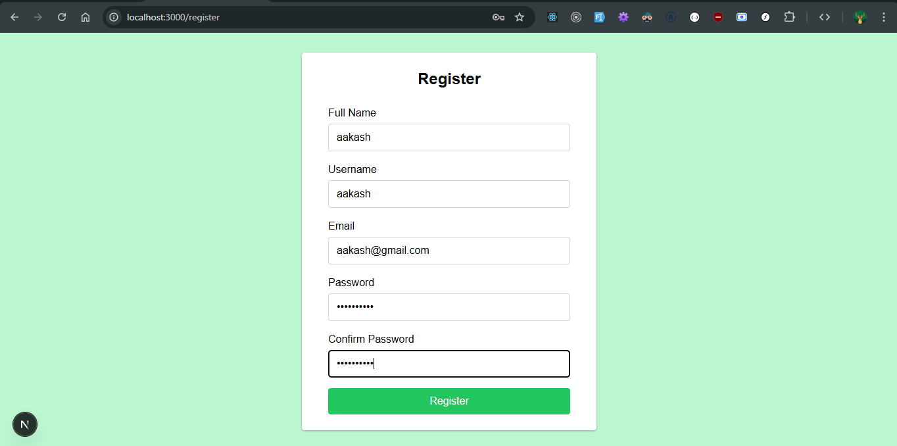
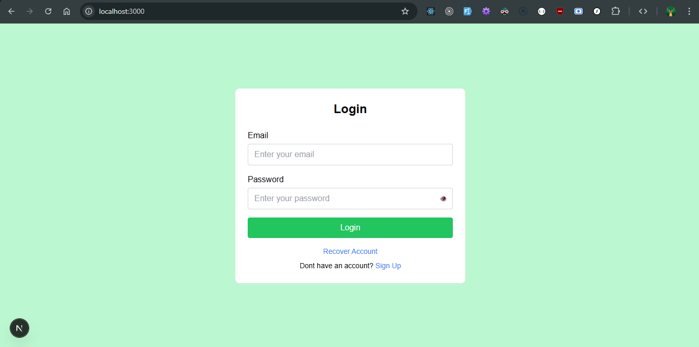
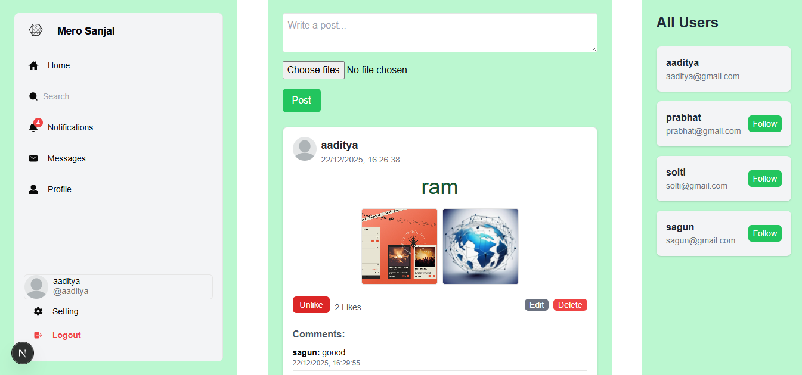
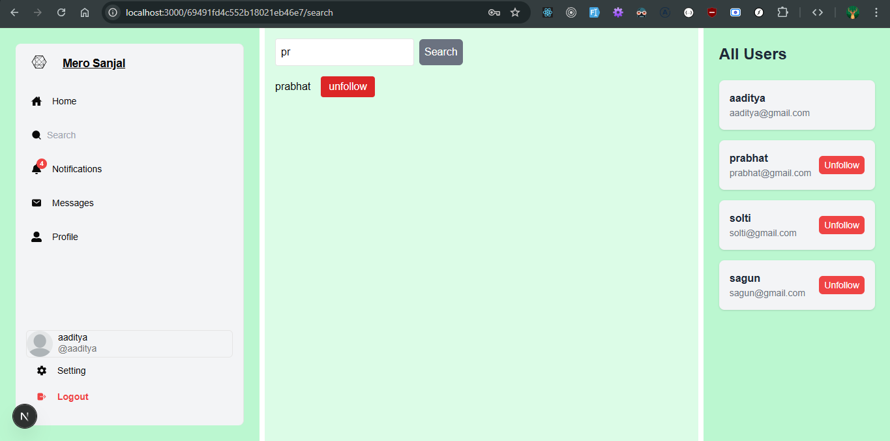
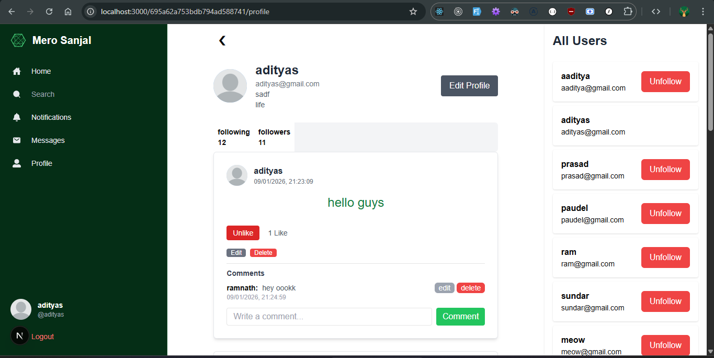
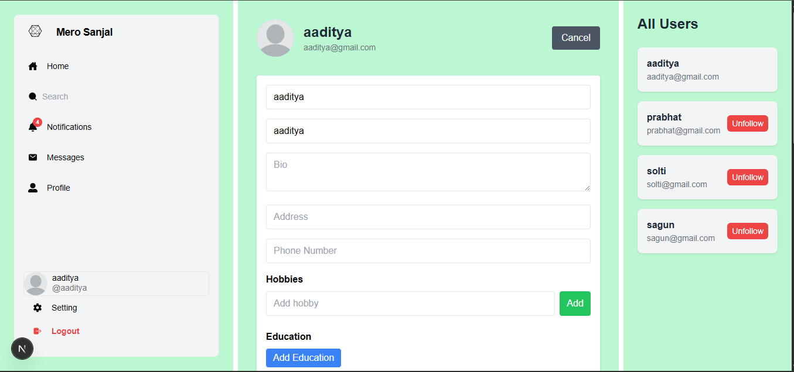
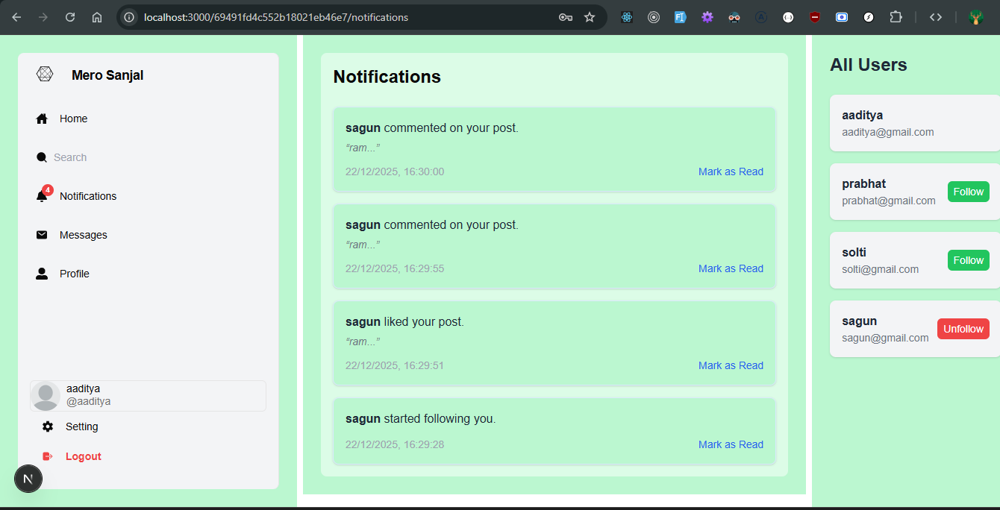
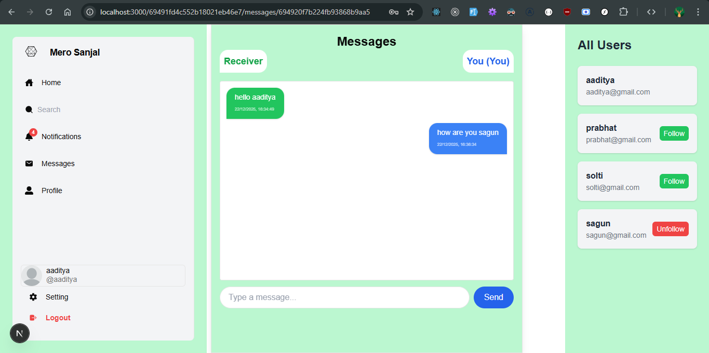

# NextJS & Express Social Media Site

## Tech Stack

- Frontend: Next js App Router with Javascript & Tailwind CSS
- Backend: Express.js with Mongodb
- Styling: Tailwind CSS, NextUI, Shadcn
- Icons: React Icons, Lucide React
- Form Handling: Formik with Yup validation
- AI-Assisted Development: V0.dev, ChatGPT, Gemini
- Utilities: util

---

# MERN Social Media App - Project Checklist

---

## **Phase 1: Essential Features (MVP)**

- [x] **User Authentication & Authorization**

  - [x] Sign up / Log in / Log out
  - [x] JWT-based authentication
  - [x] Password hashing (bcrypt)

- [x] **User Profiles**

  - [x] View profile
  - [x] Edit profile (name, bio, address, education, work etc)
  - [x] Follow / Unfollow users

- [x] **Posts**

  - [x] Create post (text)
  - [x] Read posts (feed)
  - [x] Update post
  - [x] Delete post

- [x] **Likes / Reactions**

  - [x] Like / Unlike posts
  - [x] Display number of likes

- [x] **Comments**

  - [x] Add comment
  - [x] Edit comment
  - [x] Delete comment

- [x] **Feed / Timeline**
  - [x] Display posts from followed users

---

## **Phase 2: Intermediate Features**

- [x] **Search**

  - [x] Search users by name

- [x] **Notifications**

  - [x] Notify when someone likes a post
  - [x] Notify when someone comments
  - [x] Notify when someone follows

- [x] **Post Media**

  - [x] Upload images with posts

- [x] **Profile Customization**
  - [x] Edit name, bio, address, education, work etc

---

## **Phase 3: Advanced / Optional Features with Socket.io Integration**

- [x] **Real-time Feed Updates**

  - [x] Live updates for posts
  - [x] Live likes/comments count

- [x] **Direct Messaging (DMs)**
  - [x] Chat between users
  - [x] Real-time using Socket.io

---

## **Phase 4: Deployment to Vercel and Render**
- [x] **Deployment**
  - [x] Deployed frontend to vercel
  - [x] Deployed backend to render


---
## Getting Started

1. Clone the repository

   ```
   git clone https://github.com/adityaspaudel/socialmedia.git
   ```

2. Install dependencies for both the client and server

   ```
   cd client
   pnpm install

   cd ../server
   pnpm install
   ```

3. Set up environment variables
   Create a `.env` file in the root directory of both the client and server and add necessary variables.

4. Run the development server

   ```
   cd MeroSanjal/client
   pnpm  dev
   ```

   For the backend server:

   ```
   cd ../server
   pnpm  dev
   ```

5. Open [http://localhost:3000](http://localhost:3000) with your browser to see the frontend.

6. Backend server will run on [http://localhost:8000](http://localhost:8000) by default.

## 🌐 Live Demo

- **Frontend (Vercel):** https://merosanjall.vercel.app
- **Backend (Render):** https://merosanjal.onrender.com/

# Project Screenshots

## User Registration



## User Login



## User Home



## User Search



## User Profile



## User Edit / Update



## User Notifications



## User Chat between User



<!-- ## Contributing

Please read [CONTRIBUTING.md](CONTRIBUTING.md) for details on our code of conduct and the process for submitting pull requests.

## License

This project is licensed under the MIT License - see the [LICENSE.md](LICENSE.md) file for details.
 -->

<!--

{
  "name": "nextjs-tailwind-frontend",
  "version": "1.1.0",
  "description": "Next.js + Tailwind CSS frontend with Redux and extra utilities",
  "scripts": {
    "dev": "next dev",
    "build": "next build",
    "start": "next start",
    "lint": "eslint . --ext .js,.jsx,.ts,.tsx --fix"
  },
  "keywords": ["nextjs", "tailwindcss", "react", "frontend", "redux"],
  "author": "Your Name",
  "license": "MIT",
  "dependencies": {
    "axios": "^1.6.0",
    "axios-hooks": "^2.13.0",
    "clsx": "^2.0.0",
    "date-fns": "^2.31.0",
    "dayjs": "^1.12.8",
    "framer-motion": "^12.7.0",
    "headlessui": "^1.8.4",
    "jsdom": "^22.1.0",
    "lucide-react": "^0.349.0",
    "lodash": "^4.17.21",
    "next": "^14.6.4",
    "next-auth": "^5.3.1",
    "next-themes": "^0.2.2",
    "react": "^18.3.0",
    "react-dom": "^18.3.0",
    "react-error-boundary": "^3.1.4",
    "react-hot-toast": "^2.5.2",
    "react-icons": "^4.11.0",
    "react-modal": "^3.16.1",
    "react-query": "^3.39.4",
    "react-query-devtools": "^3.2.1",
    "react-redux": "^8.2.1",
    "@reduxjs/toolkit": "^1.5.0",
    "redux-logger": "^3.0.6",
    "redux-persist": "^6.0.0",
    "react-spring": "^9.8.7",
    "react-toastify": "^9.3.2",
    "shadcn-ui": "^1.0.0",
    "swr": "^2.2.3",
    "tailwindcss": "^4.3.2",
    "@tailwindcss/aspect-ratio": "^1.0.1",
    "@tailwindcss/forms": "^0.5.3",
    "@tailwindcss/line-clamp": "^0.4.2",
    "@tailwindcss/typography": "^1.9.0",
    "@heroicons/react": "^2.0.18",
    "tailwind-variants": "^1.1.1",
    "react-use": "^20.4.1",
    "react-virtual": "^3.0.0",
    "notistack": "^2.0.8",
    "@radix-ui/react-tooltip": "^1.0.4",
    "@radix-ui/react-dialog": "^1.0.4",
    "@radix-ui/react-popover": "^1.0.4",
    "focus-trap-react": "^9.0.3",
    "uuid": "^9.0.0",
    "immer": "^10.0.0",
    "zustand": "^5.1.0",
    "zustand-middleware": "^0.0.1",
    "tiny-invariant": "^1.3.1",
    "zod": "^3.25.0"
  },
  "devDependencies": {
    "@testing-library/jest-dom": "^6.0.0",
    "@testing-library/react": "^14.0.0",
    "cypress": "^12.14.0",
    "eslint": "^8.48.0",
    "prettier": "^3.0.0"
  }
}

-->

<!--

{
  "name": "mern-backend",
  "version": "1.1.0",
  "description": "Production-ready Express + MongoDB backend with extra utilities",
  "main": "index.js",
  "type": "commonjs",
  "scripts": {
    "start": "node index.js",
    "dev": "nodemon index.js",
    "lint": "eslint . --fix",
    "test": "jest"
  },
  "keywords": ["express", "mongodb", "mern", "backend"],
  "author": "Your Name",
  "license": "MIT",
  "dependencies": {
    "bcryptjs": "^2.5.0",
    "bull": "^4.12.0",
    "bull-board": "^3.9.2",
    "compression": "^1.7.4",
    "cookie-parser": "^1.4.6",
    "cookie-session": "^2.0.0",
    "cors": "^2.8.5",
    "dayjs": "^1.12.8",
    "dotenv": "^16.1.4",
    "dotenv-flow": "^3.3.1",
    "express": "^4.18.2",
    "express-async-errors": "^3.1.1",
    "express-mongo-sanitize": "^2.2.0",
    "express-rate-limit": "^7.0.0",
    "express-validator": "^7.0.1",
    "express-xss-sanitizer": "^0.1.1",
    "helmet": "^7.0.0",
    "helmet-csp": "^2.10.0",
    "hpp": "^0.2.3",
    "http-status-codes": "^2.2.0",
    "ioredis": "^5.3.2",
    "jsonwebtoken": "^9.0.0",
    "jsonwebtoken-blacklist": "^1.0.1",
    "mongoose": "^7.5.0",
    "mongoose-unique-validator": "^3.1.0",
    "morgan": "^1.10.0",
    "morgan-body": "^3.0.0",
    "multer": "^1.4.5-lts.1",
    "nodemailer": "^6.9.4",
    "uuid": "^9.0.0",
    "winston": "^3.12.0",
    "xss": "^1.0.14",
    "swagger-ui-express": "^5.1.1",
    "swagger-jsdoc": "^6.2.8",
    "socket.io": "^4.7.2",
    "jsdom": "^22.1.0",
    "dompurify": "^3.0.7",
    "express-fileupload": "^1.4.0",
    "rate-limiter-flexible": "^2.5.2",
    "celebrate": "^15.0.1",
    "clsx": "^2.0.0"
  },
  "devDependencies": {
    "cross-env": "^7.0.3",
    "concurrently": "^8.2.1",
    "eslint": "^8.48.0",
    "jest": "^29.7.0",
    "nodemon": "^3.0.1",
    "prettier": "^3.0.0",
    "supertest": "^6.3.3",
    "mongodb-memory-server": "^8.15.1"
  }
}


-->

<!--EMAIL_USER = "adityaspaudel@gmail.com";
EMAIL_PASS = "ivmf ilgt npdb ncvn";-->
